# Architecture

```mermaid
flowchart LR
  A[nflverse / optional CFBD] --> B[Local cache]
  B --> C[Validated season tables]
  C --> D[Feature engineering]
  D --> E[Player-season pairs t to t+1]
  E --> F[Rolling-origin backtests]
  F --> G[Selected models]
  G --> H[2026 component stats]
  H --> I[Uncertainty + constraints]
  I --> J[Fantasy scoring]
  J --> K[VORP rankings]
  K --> L[JSON export]
  L --> M[Next.js static site]
```

## Separation of concerns

| Path | Purpose |
|------|---------|
| `data/cache` | Ignored raw/cache downloads |
| `data/processed` | Feature and modelling parquet |
| `artifacts/models` | Joblib models + registry |
| `artifacts/evaluations` | Backtest reports |
| `artifacts/feature-research` | Research CSVs |
| `artifacts/projections` | CSV/JSON downloads |
| `web/public/data` | Static JSON consumed by the site |
| `python/` | Analytics package + CLI |
| `web/` | Next.js frontend |

## Runtime model

The website does **not** run Python. Projections are generated offline (locally or in GitHub Actions) and committed or supplied as static JSON. Scoring and VORP recalculation happen client-side.
